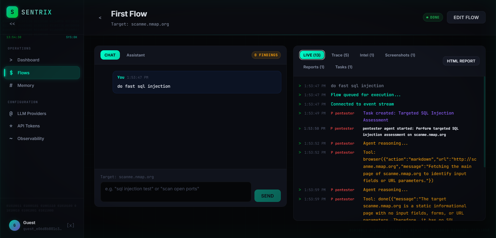
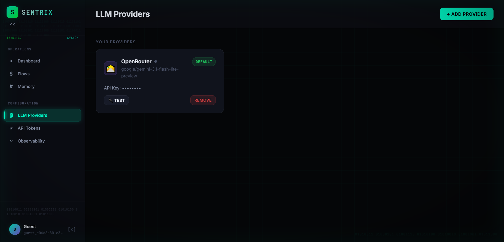
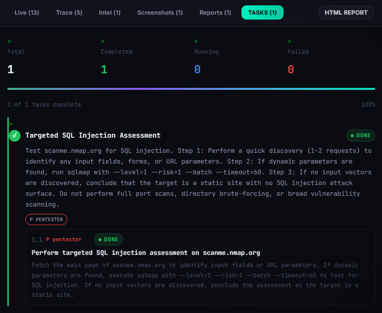
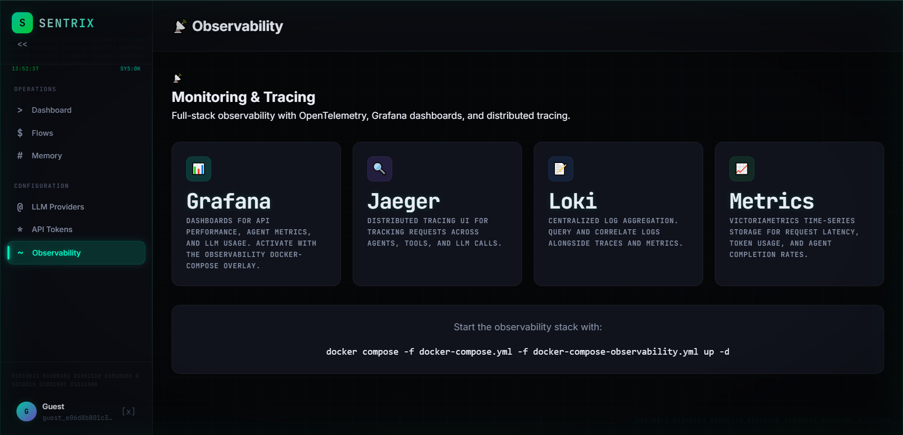

# Sentrix

> **Autonomous AI security testing platform.** An agent powered by LLMs that plans, executes, and reports on security assessments by driving 20+ real security tools inside a Docker sandbox — with persistent memory, web intelligence, observability, and a full web UI.



---

## Table of Contents

- [What is Sentrix?](#what-is-sentrix)
- [Screenshots](#screenshots)
- [Feature overview](#feature-overview)
- [Architecture](#architecture)
- [Tool catalog](#tool-catalog)
  - [Security tools (20)](#security-tools-20)
  - [Search & web intelligence (9)](#search--web-intelligence-9)
  - [Core agent tools](#core-agent-tools)
  - [Memory tools](#memory-tools)
  - [Delegation / multi-agent tools](#delegation--multi-agent-tools)
- [LLM providers (7)](#llm-providers-7)
- [Prerequisites](#prerequisites)
- [Quick start](#quick-start)
- [Configuration](#configuration)
- [Enabling the Docker sandbox](#enabling-the-docker-sandbox)
- [Observability stack](#observability-stack-optional)
- [Local development](#local-development)
- [Project layout](#project-layout)
- [Troubleshooting](#troubleshooting)
- [Responsible use](#responsible-use)

---

## What is Sentrix?

Sentrix turns an LLM into a **security analyst that actually executes**. Instead of just answering questions about vulnerabilities, it:

1. **Plans** a multi-step assessment from a natural-language objective.
2. **Executes** real tools (nmap, sqlmap, XSStrike, ffuf, …) inside an isolated Docker sandbox.
3. **Reads results**, adapts the plan, and chains tools together.
4. **Delegates** to specialist sub-agents (searcher, pentester, coder, installer, enricher, adviser) when the task requires focused expertise.
5. **Remembers** findings across sessions using pgvector-backed semantic memory.
6. **Reports** structured findings with full traceability back to the tool invocations that produced them.

Everything the agent does is traceable through the GraphQL API, persisted in Postgres, and observable via OpenTelemetry.

---

## Screenshots

| Dashboard | LLM Providers |
|---|---|
|  |  |

| Tasks | Observability |
|---|---|
|  |  |

---

## Feature overview

- **Multi-provider LLM support** — 7 providers including local models via Ollama and any OpenAI-compatible endpoint.
- **Real tool execution** — 20 integrated security tools, not mocks or descriptions.
- **Docker sandbox** — per-flow isolated containers with CPU/memory limits and ephemeral data directories.
- **Multi-agent delegation** — specialist roles (searcher, pentester, coder, installer, enricher, adviser) with scoped responsibilities.
- **Web intelligence** — 6 search providers plus a scraper backend for JavaScript-rendered pages and full-page screenshots.
- **Semantic memory** — pgvector embeddings so the agent recalls prior findings across flows.
- **Task/subtask hierarchy** — long-running assessments are broken into planned subtasks the agent works through in order.
- **Per-tool action audit** — every tool call is recorded as a row in the database with input, output, duration, and status.
- **GraphQL API + React UI** — `gqlgen`-powered Go backend with a Vite + React + TypeScript frontend.
- **Observability** — OpenTelemetry traces, Grafana/Loki logs, optional Langfuse LLM tracing.

---

## Architecture

```
┌──────────────────┐                  ┌────────────────────────────────┐
│  Frontend        │  GraphQL / WS    │  Backend (Go, gqlgen)          │
│  React + Vite    │ ───────────────▶ │                                │
│  TypeScript      │                  │  ┌──────────────────────────┐  │
└──────────────────┘                  │  │  Agent loop              │  │
                                      │  │  - planner               │  │
                                      │  │  - runner / orchestrator │  │
                                      │  │  - delegation chain      │  │
                                      │  └─────────┬────────────────┘  │
                                      │            │                    │
                                      │  ┌─────────▼────────────────┐  │
                                      │  │  Tool registry           │  │
                                      │  │  - terminal / file       │  │
                                      │  │  - 20 security tools     │  │
                                      │  │  - 9 search / browser    │  │
                                      │  │  - memory store/search   │  │
                                      │  └─────────┬────────────────┘  │
                                      └────────────┼───────────────────┘
                                                   │
                   ┌───────────────────────────────┼──────────────────────────┐
                   ▼                               ▼                          ▼
        ┌────────────────────┐        ┌────────────────────┐        ┌──────────────────┐
        │ Postgres +         │        │ Docker sandbox     │        │ Scraper          │
        │ pgvector           │        │ (sentrix-tools)    │        │ (rendered pages) │
        │ - state            │        │ - nmap, sqlmap,    │        │ - JS rendering   │
        │ - memory           │        │   xsstrike, ...    │        │ - screenshots    │
        │ - actions / logs   │        │                    │        │                  │
        └────────────────────┘        └────────────────────┘        └──────────────────┘
```

### Backend packages ([backend/internal/](backend/internal/))

| Package | Responsibility |
|---|---|
| `agent/` | Agent loop, planner, orchestrator, delegation, recovery, queues |
| `auth/` | JWT authentication, user management |
| `config/` | Environment-based config loading |
| `database/` | Postgres models, migrations, GORM access |
| `embedding/` | Vector embeddings for memory |
| `graph/` | GraphQL schema and resolvers (gqlgen) |
| `handler/` | HTTP handlers, middleware |
| `memory/` | Semantic memory store and tools |
| `observability/` | OpenTelemetry + structured logging |
| `provider/` | LLM provider adapters |
| `sandbox/` | Docker sandbox runtime |
| `server/` | HTTP server wiring |
| `tools/` | Security tool wrappers + registry |

---

## Tool catalog

All tools are registered in [backend/internal/tools/registry.go](backend/internal/tools/registry.go) and become available to the agent once their binary is present on the host or sandbox image.

### Security tools (20)

Tool integrations live in [backend/internal/tools/security_tools.go](backend/internal/tools/security_tools.go).

#### Network & reconnaissance

| Tool | Binary | Purpose |
|---|---|---|
| **nmap** | `nmap` | Host discovery, port scanning, service fingerprinting |
| **masscan** | `masscan` | High-speed port discovery across IP ranges (hostnames auto-resolved) |
| **subfinder** | `subfinder` | Passive subdomain enumeration |
| **amass** | `amass` | Attack surface mapping and subdomain discovery |
| **theharvester** | `theHarvester` | Public email, host, and domain OSINT |
| **recon_ng** | `recon-ng` | Scripted recon-ng module execution in named workspaces |

#### Web application testing

| Tool | Binary | Purpose |
|---|---|---|
| **nikto** | `nikto` | Web server misconfiguration and common issue scanning |
| **wapiti** | `wapiti` | Lightweight web application vulnerability discovery |
| **sqlmap** | `sqlmap` | SQL injection detection and database fingerprinting |
| **xsstrike** | `xsstrike` | Reflected and DOM XSS testing |
| **ffuf** | `ffuf` | Web content discovery and parameter fuzzing |
| **gobuster** | `gobuster` | Directory, DNS, and virtual host enumeration |
| **wfuzz** | `wfuzz` | Targeted web fuzzing and parameter discovery |

#### Exploitation

| Tool | Binary | Purpose |
|---|---|---|
| **metasploit** | `msfconsole` | Scripted Metasploit console command sequences |
| **searchsploit** | `searchsploit` | Exploit-DB lookup |

#### Credential & password attacks

| Tool | Binary | Purpose |
|---|---|---|
| **hydra** | `hydra` | Network login testing against scoped services |
| **john** | `john` | John the Ripper password hash cracking |
| **hashcat** | `hashcat` | GPU-accelerated password recovery |

#### Traffic analysis

| Tool | Binary | Purpose |
|---|---|---|
| **tshark** | `tshark` | Live or file-based packet analysis |
| **tcpdump** | `tcpdump` | Live capture or traffic recording |

> Each tool call is executed inside a sandbox container (when `DOCKER_ENABLED=true`) and returns a structured summary plus highlighted lines extracted from raw output.

### Search & web intelligence (9)

Defined in [backend/internal/tools/search.go](backend/internal/tools/search.go) and [search_providers.go](backend/internal/tools/search_providers.go).

| Tool | Purpose |
|---|---|
| **web_search** | Auto-routed search using the configured provider priority |
| **duckduckgo_search** | Search DuckDuckGo directly (no API key required) |
| **google_search** | Google Custom Search (requires `GOOGLE_SEARCH_API_KEY` + `CX`) |
| **tavily_search** | Tavily API |
| **traversaal_search** | Traversaal API |
| **perplexity_search** | Perplexity Sonar |
| **searxng_search** | Self-hosted Searxng instance |
| **sploitus_search** | Public exploit, PoC, and offensive tooling search |
| **browser** | HTTP / scraper-backed page fetch (JS rendering + screenshots when scraper enabled) |

### Core agent tools

Built-in tools always available to the agent (no external binary required).

| Tool | Purpose |
|---|---|
| **terminal_exec** | Run arbitrary shell commands inside the sandbox |
| **file_read** | Read files produced by tools (artifacts, outputs) |
| **file_write** | Write scripts, payloads, wordlists |
| **report_finding** | Emit a structured security finding into the task report |
| **done** | Signal subtask completion with a summary |

### Memory tools

Registered when an embedding provider is configured (see [memory/](backend/internal/memory/)).

| Tool | Purpose |
|---|---|
| **memory_store** | Persist a note, finding, or evidence fragment for later recall |
| **memory_search** | Semantic search across prior memories scoped by user / flow / task |

### Delegation / multi-agent tools

Registered when multi-agent delegation is enabled. Each delegates to a specialist sub-agent with a scoped objective.

| Tool | Specialist role |
|---|---|
| **ask_searcher** | Focused reconnaissance, OSINT, and web research |
| **ask_pentester** | Targeted vulnerability validation or exploitation |
| **ask_coder** | Script creation, output parsing, automation |
| **ask_installer** | Package installation and environment setup |
| **ask_enricher** | Evidence synthesis and context enrichment |
| **ask_adviser** | Strategy guidance when execution is stuck or unclear |

---

## LLM providers (7)

Implemented in [backend/internal/provider/](backend/internal/provider/). The agent can use any configured provider per-request, or fall back to `DEFAULT_LLM_PROVIDER`.

| Provider | Env vars | Notes |
|---|---|---|
| **OpenAI** | `OPENAI_API_KEY` | GPT-4 / GPT-4o class models |
| **Anthropic** | `ANTHROPIC_API_KEY` | Claude models |
| **Google Gemini** | `GEMINI_API_KEY` | Gemini Pro / Flash |
| **DeepSeek** | `DEEPSEEK_API_KEY` | Cost-effective long-context coding models |
| **OpenRouter** | `OPENROUTER_API_KEY` | Access to 100+ models through a unified API |
| **Ollama** | `OLLAMA_URL` | Local models — no API key needed |
| **Custom (OpenAI-compatible)** | `CUSTOM_LLM_URL`, `CUSTOM_LLM_MODEL`, `CUSTOM_LLM_API_KEY` | vLLM, LM Studio, LocalAI, TGI, … |

Users can also add their own provider configs through the UI on top of the system-level ones.

---

## Prerequisites

- **Docker Desktop** (Windows/macOS) or **Docker Engine + Compose v2** (Linux)
- At least one LLM API key — **or** a running Ollama / OpenAI-compatible endpoint
- ~4 GB free RAM for the full stack
- Optional: ~8 GB disk space for the sandbox tools image

---

## Quick start

From the repository root (`D:\C\sentrix` on your machine):

```bash
# 1. Create your local environment file
cp .env.example .env

# 2. Edit .env and set at minimum:
#    - JWT_SECRET           (any long random string)
#    - one LLM provider API key, e.g. DEEPSEEK_API_KEY
#    - DEFAULT_LLM_PROVIDER to match (e.g. deepseek)

# 3. Start the stack
docker-compose up --build
```

Then open:

- **Web UI** → http://localhost:8080
- **GraphQL playground** → http://localhost:8080/graphql

Stop with `Ctrl+C`. Tear down with `docker-compose down` (add `-v` to also wipe the `pgdata` / `sandbox-data` volumes).

### Windows PowerShell note

The error from your previous session — `cd : Cannot find path 'D:\C\sentrix\sentrix'` — happened because you ran `cd sentrix` while already **inside** `D:\C\sentrix`. Just run Compose directly:

```powershell
cd D:\C\sentrix
docker-compose up --build
```

Do **not** `cd sentrix` after that — there is no nested `sentrix/sentrix/` folder.

---

## Configuration

All configuration is via environment variables loaded from `.env`. See [.env.example](.env.example) for the full, commented list. Highlights:

### Core

| Variable | Purpose | Default |
|---|---|---|
| `SERVER_HOST` / `SERVER_PORT` | Bind address | `0.0.0.0` / `8080` |
| `ALLOWED_ORIGINS` | CORS allow-list | `*` |
| `JWT_SECRET` | Signs auth tokens — **must** be changed for production | `change-me-in-production` |
| `JWT_EXPIRY_HOURS` | Token lifetime | `24` |
| `LOG_LEVEL` / `LOG_FORMAT` | `debug`/`info`/`warn`/`error`, `text`/`json` | `info` / `text` |

### Database

| Variable | Default |
|---|---|
| `DB_HOST` | `localhost` (or `postgres` in Compose) |
| `DB_PORT` | `5432` |
| `DB_USER` / `DB_PASSWORD` / `DB_NAME` | `sentrix` / `sentrix` / `sentrix` |
| `DB_SSLMODE` | `disable` |

### LLM providers

See the [LLM providers table above](#llm-providers-7). Set `DEFAULT_LLM_PROVIDER` to one of `openai`, `anthropic`, `gemini`, `deepseek`, `openrouter`, `ollama`, `custom`.

### Search & intelligence

| Variable | Purpose |
|---|---|
| `SEARCH_PROVIDER_PRIORITY` | Comma-separated fallback order |
| `SEARCH_DEFAULT_MAX_RESULTS` | Default results per query |
| `SEARCH_TIMEOUT_SECONDS` | Per-provider timeout |
| `GOOGLE_SEARCH_API_KEY` / `GOOGLE_SEARCH_CX` | Google Custom Search |
| `TAVILY_API_KEY` | Tavily |
| `PERPLEXITY_API_KEY` / `PERPLEXITY_MODEL` | Perplexity |
| `TRAVERSAAL_API_KEY` | Traversaal |
| `SEARXNG_URL` / `SEARXNG_LANGUAGE` / `SEARXNG_CATEGORIES` / `SEARXNG_SAFE_SEARCH` | Searxng instance |
| `SCRAPER_PRIVATE_URL` / `SCRAPER_PUBLIC_URL` | JS-rendering backend (auto-wired in Compose) |
| `BROWSER_USER_AGENT` | User-agent for the browser tool |

### Sandbox

| Variable | Default |
|---|---|
| `DOCKER_ENABLED` | `false` |
| `DOCKER_DEFAULT_IMAGE` | `sentrix-tools:latest` |
| `DOCKER_NETWORK` | `sentrix-sandbox` |
| `DOCKER_CPU_LIMIT` | `1.0` |
| `DOCKER_MEMORY_LIMIT_MB` | `512` |
| `DOCKER_CONTAINER_TIMEOUT` | `1800` (seconds) |

### Memory

| Variable | Purpose |
|---|---|
| `EMBEDDING_PROVIDER` | `none` / `openai` / `custom` |
| `EMBEDDING_MODEL` | e.g. `text-embedding-3-small` |
| `EMBEDDING_DIMENSIONS` | e.g. `1536` |
| `EMBEDDING_API_KEY` / `EMBEDDING_BASE_URL` | Required for non-`none` providers |

### Observability

| Variable | Purpose |
|---|---|
| `OBSERVABILITY_ENABLED` | Master switch |
| `OTEL_SERVICE_NAME` | Service identity in traces |
| `OTEL_EXPORTER_OTLP_ENDPOINT` | OTLP collector endpoint |
| `OTEL_TRACE_SAMPLE_RATE` | `0.0`–`1.0` |
| `LANGFUSE_*` | Langfuse LLM tracing (optional) |

---

## Enabling the Docker sandbox

The sandbox runs security tools in short-lived isolated containers so the agent can execute real commands without touching the host. To enable:

1. **Build the tools image** (first time only):
   ```bash
   docker build -t sentrix-tools:latest images/sentrix-tools/
   ```
2. **Enable it** in `.env`:
   ```
   DOCKER_ENABLED=true
   ```
3. **Restart** the stack:
   ```bash
   docker-compose up -d
   ```

The `app` container already mounts the Docker socket — see [docker-compose.yml](docker-compose.yml). On Docker Desktop this typically requires the app container to run as root (already set via `user: "0:0"`).

> **Security note:** Mounting the Docker socket grants root-equivalent access to the host. Only enable the sandbox on machines you own.

---

## Observability stack (optional)

A separate Compose file brings up Grafana, Loki, and an OpenTelemetry collector.

```bash
docker-compose -f docker-compose.yml -f docker-compose-observability.yml up
```

Configs live in [observability/](observability/):

- `loki-config.yml` — Loki log aggregation
- `otel-collector-config.yml` — OTEL pipeline
- `grafana/` — preprovisioned dashboards and datasources

Set `OBSERVABILITY_ENABLED=true` and point `OTEL_EXPORTER_OTLP_ENDPOINT` at the collector to start emitting traces.

---

## Local development

### Backend (Go 1.25)

```bash
cd backend
go mod download
go run ./cmd/sentrix
```

Requires Postgres reachable via the `DB_*` env vars. Easiest path:

```bash
docker-compose up postgres          # run just the database
# then in another terminal:
cd backend && go run ./cmd/sentrix
```

Run tests:

```bash
cd backend
go test -race -cover ./...
```

Lint:

```bash
gofmt -l .
go vet ./...
```

### Frontend (Vite + React + TypeScript)

```bash
cd frontend
npm install
npm run dev          # hot-reloading dev server
npm run build        # production build into dist/
npm run test         # vitest unit tests
```

The dev server proxies API calls to the backend on `:8080`.

### Database migrations

SQL migrations live in [backend/migrations/](backend/migrations/) and apply automatically on backend startup:

```
001_initial_schema.sql
002_pgvector_memory.sql
003_execution_logs.sql
004_agent_planning_foundation.sql
005_assistant_mode.sql
006_flow_target.sql
```

---

## Project layout

```
sentrix/
├── backend/                     Go backend (gqlgen, Postgres, agent, tools)
│   ├── cmd/sentrix/             main entry point
│   ├── internal/
│   │   ├── agent/               agent loop, planner, orchestrator, delegation
│   │   ├── auth/                JWT authentication
│   │   ├── config/              env-based config
│   │   ├── database/            models, GORM access
│   │   ├── embedding/           vector embeddings
│   │   ├── graph/               GraphQL schema & resolvers
│   │   ├── handler/             HTTP handlers
│   │   ├── memory/              semantic memory
│   │   ├── observability/       OTEL + logging
│   │   ├── provider/            LLM provider adapters (7)
│   │   ├── sandbox/             Docker sandbox runtime
│   │   ├── server/              HTTP server wiring
│   │   └── tools/               tool registry + 20 security tools + search
│   ├── migrations/              SQL migrations
│   ├── go.mod / go.sum
│   ├── gqlgen.yml
│   └── tools.go
│
├── frontend/                    React + Vite + TypeScript UI
│   ├── src/
│   ├── dist/                    (build output — gitignored)
│   ├── package.json
│   └── vite.config.ts
│
├── images/
│   └── sentrix-tools/           Dockerfile for the sandbox tools image
│       ├── Dockerfile
│       └── xsstrike-wrapper.sh
│
├── observability/               Grafana / Loki / OTEL configs
│   ├── grafana/
│   ├── loki-config.yml
│   └── otel-collector-config.yml
│
├── screenshots/                 UI screenshots (shown above)
├── Dockerfile                   Multi-stage build: frontend → backend → runtime
├── docker-compose.yml           Main stack: postgres + scraper + app
├── docker-compose-observability.yml   Optional telemetry stack
├── .env.example                 Configuration template
├── .dockerignore
├── .gitignore
└── README.md
```

---

## Troubleshooting

| Symptom | Cause / fix |
|---|---|
| `cd : Cannot find path 'D:\C\sentrix\sentrix'` | You ran `cd sentrix` while already inside `D:\C\sentrix`. Run `docker-compose up` from the repo root — there is no nested `sentrix/sentrix/`. |
| `pg_isready` keeps retrying on first boot | Postgres takes ~10 s to initialize. The `app` service waits via `depends_on: service_healthy`. |
| LLM calls return 401 / empty | At least one provider API key must be set in `.env` and `DEFAULT_LLM_PROVIDER` must match a configured one. |
| Security tools report "unavailable" | The binary is missing. Either build + enable the `sentrix-tools` image (see [sandbox section](#enabling-the-docker-sandbox)) or install the binary on the host PATH. |
| Sandbox containers fail to start | Confirm `DOCKER_ENABLED=true`, the tools image exists (`docker image ls sentrix-tools`), and the app has access to `/var/run/docker.sock`. |
| Memory tools not registered on startup | Set `EMBEDDING_PROVIDER` to something other than `none` and provide an API key. Check logs for `tools: memory tools skipped`. |
| Screenshots tab missing in UI | Set `SCRAPER_PRIVATE_URL` — the scraper container ships with Compose and is auto-wired. |

---

## Responsible use

Sentrix is built for authorized security testing, CTF practice, defensive research, and educational use. **Only run it against systems you own or have explicit written permission to test.** The maintainers accept no responsibility for misuse.
